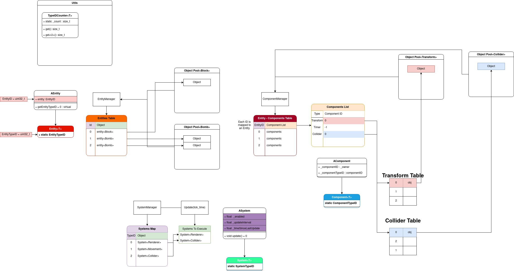

# redCodeEngine
Work in Progress
I am learning the ECS design pattern with this gameEngine

## Architecture

This is a typed engine, meaning every entity, component and system are divided in pools of their respective types
This is done for contiguous memory

### Things implements and to implement
- [x] Entity Manager
- [x] Component Manager
- [x] System Manager
- [x] Main engine update loop
- [] Exceptions
- [x] Scene System
- [] PoolAllocator
- [] LinearAllocator
- [] Typed Table to replace Maps
